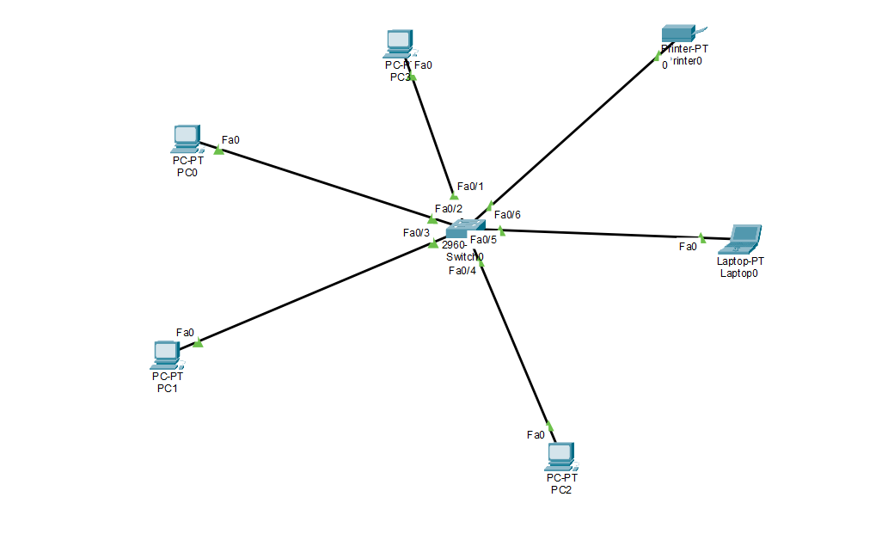

# pt-star-topology-lab
A simple LAN simulation using Star Topology in Cisco Packet Tracer, featuring static IP addressing and verified device connectivity.

# Star Topology LAN — Cisco Packet Tracer

## Overview
A simple Local Area Network (LAN) built using a **Star Topology** in Cisco Packet Tracer, 
created to practice fundamental networking concepts including device addressing, switching, 
and connectivity testing.

## Network Topology

All end devices connect directly to a central **Cisco Catalyst 2960-24TT Switch**, forming 
a classic star topology where each node has a single dedicated link to the switch.

## Devices
| Device    | Switch Port |
|-----------|-------------|
| PC0       | Fa0/2       |
| PC1       | Fa0/3       |
| PC2       | Fa0/4       |
| PC3       | Fa0/1       |
| Laptop0   | Fa0/5       |
| Printer0  | Fa0/6       |

## IP Addressing Table
| Device    | IP Address      | Subnet Mask     |
|-----------|-----------------|-----------------|
| PC0       | 192.168.10.10   | 255.255.255.0   |
| PC1       | 192.168.10.11   | 255.255.255.0   |
| PC2       | 192.168.10.12   | 255.255.255.0   |
| PC3       | 192.168.10.14   | 255.255.255.0   |
| Laptop0   | 192.168.10.13   | 255.255.255.0   |
| Printer0  | 192.168.10.15   | 255.255.255.0   |

## Switch Port Status
| Port  | Link Status | Connected Device |
|-------|-------------|-------------------|
| Fa0/1 | Up          | PC3               |
| Fa0/2 | Up          | PC0               |
| Fa0/3 | Up          | PC1               |
| Fa0/4 | Up          | PC2               |
| Fa0/5 | Up          | Laptop0           |
| Fa0/6 | Up          | Printer0          |

## Connectivity Test
Ping tests were performed from **PC3** to three other devices on the network. 
All tests completed successfully with **0% packet loss**:

## Tools Used
- Cisco Packet Tracer 9.0.1

## What I Learned
- How to connect devices using the appropriate cable type (Copper Straight-Through)
- Configuring static IP addresses on end devices
- Understanding star topology and centralized switching
- Verifying Layer 3 connectivity using ICMP (ping)
- Reading switch port status and MAC address tables

## Project Files
- `topology.pkt` — Cisco Packet Tracer source file
- `images/topology-diagram.png` — Network topology diagram
- `images/connectivity-test.png` — Ping test results
